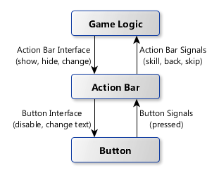

# Action Bar Logic

There are many ways to structure game logic.
With Godot, one of the most powerful tools that we have readily available is *signals*.
Signals help structure your code, and your scenes, in such a way that they are more easily reusable, easier to understand, and, most importantly, testable on their own.

To illustrate this concept, we will start by implementing the logic for the game's action bar, since it is the simplest of all components.

## General Idea

All our logic will go into the script directly attached to the `ActionBar` node.

This script will implement a number of functions for other (parent) nodes to use, which we will call the *Action Bar Interface*.
This interface should include functions to:

- show/hide the action bar;
- enable/disable the `Back` button - it should not be enabled for the first minion, since there is no minion to go back to;
- dynamically change the content of the skill buttons, to display the skills of the currently active minion.

In addition, the action bar will implement an event handler function for each of its buttons, that does something when the button is pressed.
This is where signals come into play.

The lower-level component (a button) emits a signal when it is pressed, because it does not know what logic should be executed upon firing this event.
The high-level component (the action bar) listens to button signals, identifies the button firing the signal, and then emits a **new** signal to other components higher up in the hierarchy, also because the action bar itself does not know what logic should be executed; it does not have access to all the necessary program elements.
The new signal, however, should be something more *semantic* than *pressed button*.
It could be, for instance, *skip a turn*.

The following diagram puts all this together.

