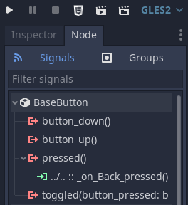
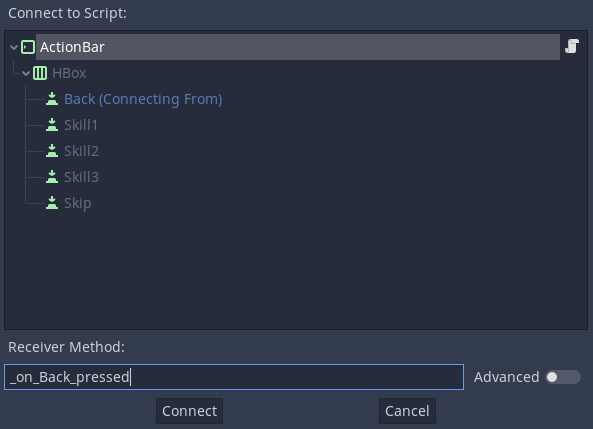

# Action Bar Logic

There are many ways to structure game logic.
With Godot, one of the most powerful tools that we have readily available is *signals*.
Signals help structure your code, and your scenes, in such a way that they are more easily reusable, easier to understand, and, most importantly, testable on their own.

To illustrate this concept, we will start by implementing the logic for the game's action bar, since it is the simplest of all components.

The full source code for the action bar's script can be found in the [`ActionBar.gd` file](https://github.com/git-afsantos/hs-mercs-clone/blob/main/scenes/battle/ActionBar.gd).

## General Idea

All our logic will go into the script directly attached to the `ActionBar` node.

This script will implement a number of functions for other (parent) nodes to use, which we will call the *Action Bar Interface*.
This interface should include functions to:

- show/hide the action bar;
- enable/disable the `Back` button - it should not be enabled for the first minion, since there is no minion to go back to;
- dynamically change the content of the skill buttons, to display the skills of the currently active minion.

In addition, the action bar will implement an event handler function for each of its buttons, that does something when the button is pressed.
This is where signals come into play.

The lower-level component (a button) emits a signal when it is pressed, because it does not know what logic should be executed upon firing this event.
The high-level component (the action bar) listens to button signals, identifies the button firing the signal, and then emits a **new** signal to other components higher up in the hierarchy, also because the action bar itself does not know what logic should be executed; it does not have access to all the necessary program elements.
The new signal, however, should be something more *semantic* than *pressed button*.
It could be, for instance, *skip a turn*.

The following diagram puts all this together.


## Action Bar Interface

Let us start with the functions that should be available in the action bar for higher-level nodes in the hierarchy.

### Show/Hide the Action Bar

This could be achieved simply by changing the `visible` attribute of the `ActionBar` itself, but, in this case, we will be doing it differently.
In the [Interface Layout](https://github.com/git-afsantos/hs-mercs-clone/tree/main/docs/tutorial/step-2#the-action-bar-scene) we set a minimum height of 40 for the action bar. This is to ensure that, first, all buttons fit within it, and, second, it always takes the same space in the overall layout of the interface.
If we make this node invisible, it will affect the overall display.
That is why we will be making the `ActionBar`'s *contents* invisible instead.
In this case, it suffices to change the visibility of its single direct child, the `HBox` node.

```gdscript
onready var _ui_hbox: HBoxContainer = $HBox

func hide_action_bar():
    _ui_hbox.visible = false

func show_action_bar():
    _ui_hbox.visible = true
```

### Enable/Disable the Back Button

This one should be easy.
We have only to access the button node and set its `disabled` property accordingly.

```gdscript
onready var _ui_back: Button = $HBox/Back

func enable_back_button():
    _ui_back.disabled = false

func disable_back_button():
    _ui_back.disabled = true
```

### Dynamically Change the Skill Buttons

Another easy one.
We have only to change the `text` of the respective button.
We will add an extra, and allow these functions to also enable/disable the buttons (for example, to allow us to have minions with less than 3 skills).

We have to choose between a single function that takes in a skill index (1st skill, 2nd skill, etc.), or having a function for each.
To keep things simple here, we will write a function for each.
We have defined from the start that each minion is going to have 3 skills, and this number does not change, so it is not a problem.

All that is left is to decide what information this button will convey.
In this case, the main items of interest for each skill are:

- its name,
- its *Speed* value, and
- its *Cooldown* value (how many rounds you have to wait before being able to use the skill again).

With that in mind, here follow the a few functions that construct a textual representation of all these pieces of information and change the text of the respective skill button.

```gdscript
onready var _ui_skill_1: Button = $HBox/Skill1
onready var _ui_skill_2: Button = $HBox/Skill2
onready var _ui_skill_3: Button = $HBox/Skill3

func set_skill_1(skill_name: String, speed: int, cooldown: int,
                 enabled: bool = true):
    _ui_skill_1.text = "%s (S: %d) (C: %d)" % [skill_name, speed, cooldown]
    _ui_skill_1.disabled = not enabled

func set_skill_2(skill_name: String, speed: int, cooldown: int,
                 enabled: bool = true):
    _ui_skill_2.text = "%s (S: %d) (C: %d)" % [skill_name, speed, cooldown]
    _ui_skill_2.disabled = not enabled

func set_skill_3(skill_name: String, speed: int, cooldown: int,
                 enabled: bool = true):
    _ui_skill_3.text = "%s (S: %d) (C: %d)" % [skill_name, speed, cooldown]
    _ui_skill_3.disabled = not enabled
```


## Action Bar Signals

This is how the `ActionBar` is going to communicate with other nodes handling high-level logic.
In this case, it is very straightforward.
We want three signals, to capture all the available actions, namely going back, skipping the turn or selecting a skill (and which skill).

```gdscript
signal select_skill(i)
signal select_back()
signal select_skip()
```

These signals will be emitted in response to the respective buttons being pressed.
All that is left is to handle these signals, then - to connect them to an event handling callback function.

For each of the `Button` children in the node tree, click on the *Node* tab, to the side of the node *Inspector*, so that we can see the available signals.



As you can see, there is a `pressed()` signal, under `BaseButton`.
Select this signal and then click on the `Connect...` button.

Select the `ActionBar` as the receiver, and set the receiver method as `_on_Back_pressed` (for the `Back` button; use similar names to other buttons).



And now, to define the function bodies.

```gdscript
func _on_Skill1_pressed():
    emit_signal("select_skill", 0)

func _on_Skill2_pressed():
    emit_signal("select_skill", 1)

func _on_Skill3_pressed():
    emit_signal("select_skill", 2)

func _on_Back_pressed():
    emit_signal("select_back")

func _on_Skip_pressed():
    emit_signal("select_skip")
```

## Conclusion

That concludes the action bar logic.
We will use a similar thought process to implement the `Minion` scene, which is another reusable component, although with different interactions.
Then, the `BattleScene` will implement the main logic and glue everything together.
