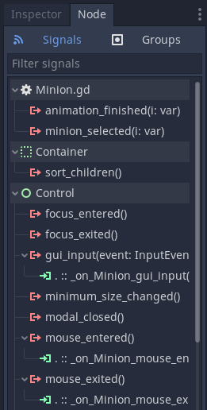
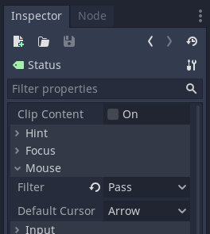

# Minion Logic

## General Idea

The `Minion` scene shares many similarities with the `ActionBar`, described in the [previous step](https://github.com/git-afsantos/hs-mercs-clone/blob/main/docs/tutorial/step-3/README.md).
It is not a top-level scene, but rather a reusable component.
As such, its logic should be implemented in a way that is independent of its parent node, as you can see in the [script file](https://github.com/git-afsantos/hs-mercs-clone/blob/main/scenes/battle/Minion.gd).

The Minion scene script should provide a functional interface, to be called by high-level logic, and its events should be communicated back to the high-level logic via signals.
In addition, `Minion` nodes will hold all the data pertaining to the minion they display, such as *Health* or *Attack* values.

> **Note:** For a more advanced and maintainable approach, all logic data should be implemented in its own files and classes (for example with `Resource`, or some class extending `Reference`).
> To simplify this tutorial, however, everything will be implemented directly in the `Minion` script.


## Minion Data

Let us start by defining all the data fields that we need for a minion *species*.
This is exactly the type of information that should be created/maintained in separate data files, and loaded as needed.
For now, we will implement everything as `export` variables, so that they are editable in the Godot Editor.

```gdscript
export (int) var minion_index: int = 0

export (int) var base_health: int = 10
export (int) var base_power: int = 4

export (String) var skill_1_name: String = "Attack"
export (int) var skill_1_speed: int = 5
export (int) var skill_1_cooldown: int = 0
export (int) var skill_1_effect: int = 0
export (int) var skill_1_hostile: bool = true

export (String) var skill_2_name: String = "Q. Attack"
export (int) var skill_2_speed: int = 3
export (int) var skill_2_cooldown: int = 0
export (int) var skill_2_effect: int = 1
export (int) var skill_2_hostile: bool = true

export (String) var skill_3_name: String = "Heal"
export (int) var skill_3_speed: int = 8
export (int) var skill_3_cooldown: int = 1
export (int) var skill_3_effect: int = 2
export (int) var skill_3_hostile: bool = false
```

Most of these variables should serve an obvious purpose.
We have got `base_health` and `base_power` values that are our reference Health and Attack values, respectively (before applying damage or effects that increase or decrease Attack).
Then we have got attributes for the 3 different skills the minion knows, such as the skill name, Speed value, cooldown, type of effect, and whether it targets an hostile target or a friendly one.

For this example, we will implement 3 different skills: a basic **Attack** (both minions deal damage to each other), a **Quick Attack** (faster, less damage, does not take damage in return) and a **Heal** (recovers some Health for a friendly minion).

> **Note:** effects are described with `int` values that serve as *keys*, or *indices*, to identify the effect.
> This is not ideal, but is an easy way to get things going.
> To aim for a more maintainable code base, the `int` literals should be replaced with `const` values, or, better yet, `enum` values.

The first variable is not related to minion data per se, but will come in handy soon.
It is an index that described the minion's position on the board.

These values are all relatively static; they are the reference values of the minion's species.
Now, we need some more variables to hold values that will be changing often during combat.

```gdscript
var minion_max_health: int = base_health
var minion_health: int = base_health
var minion_power: int = base_power
var minion_speed: int = -1 # current turn
var cd_skill_1: int = 0
var cd_skill_2: int = 0
var cd_skill_3: int = 0
```

Again, the names of the variables should be more or less self-explanatory.
They hold the current values for the minion's *Health*, *Attack* (or *Power*), *Speed* (changes every turn, depending on the chosen skill) and skill cooldowns.


## Minion Interface

The interface for a minion is quite more extensive than the interface for an action bar.
After all, there are many data fields to interact with, many mechanics to implement, as well as animations.
We will leave animations for later, though, and focus just on the core features for now.

### Taking and Healing Damage

One of the core mechanics of combat is the ability to deal/heal damage.
Without it, there would be no progress.
The implementations should be easy to understand.
We cannot drop health below zero, nor heal beyond the maximum health.
Any change to these values should update the `HealthValue` label.

```gdscript
onready var _ui_health: Label = $Parts/Stats/HealthValue

func take_damage(dmg: int):
    minion_health -= dmg
    if minion_health < 0:
        minion_health = 0
    _ui_health.text = String(minion_health)

func heal_damage(dmg: int):
    minion_health += dmg
    if minion_health > minion_max_health:
        minion_health = minion_max_health
    _ui_health.text = String(minion_health)
```

### Choosing a Skill

After choosing a skill for the minion to use in a particular round, we should update the minion's speed value and skill cooldowns.
Furthermore, we will also make its Speed tag visible, displaying the respective value.

```gdscript
onready var _ui_speed_tag: Control = $Overlay/SpeedTag
onready var _ui_speed: Label = $Overlay/SpeedTag/HBox/SpeedValue

func choose_skill(i: int):
    match i:
        0:
            minion_speed = skill_1_speed
            cd_skill_1 = skill_1_cooldown + 1
        1:
            minion_speed = skill_2_speed
            cd_skill_2 = skill_2_cooldown + 1
        2:
            minion_speed = skill_3_speed
            cd_skill_3 = skill_3_cooldown + 1
        _:
            assert(false)
            return false
    _ui_speed_tag.visible = true
    _ui_speed.text = String(minion_speed)
    return true
```

The match-all case (the underscore) followed by `assert(false)` is a nice way of catching bugs during development.
If this method ever receives a skill index that is not between 0 and 2, the program immediately crashes and you are directed to the debugger, where you can explore which value was received and what went wrong.

### Skipping a Turn

Other than using a skill, a minion can choose to skip a turn and do nothing.

Since minions will be ordered by their *Speed* values, where lower means faster, we will assign a speed value of `-1` to the *do nothing* action.
This way, minions that do nothing in a specific round are handled first and are easier to sort.
We should also update the speed tag with something that clearly states the minion is doing nothing.

```gdscript
func skip_turn():
    minion_speed = -1
    _ui_speed_tag.visible = true
    _ui_speed.text = "zZz"
    return true
```

### The End of the Round

It is common to provide an end-of-round function to call at the end of each round, in order to update internal variables such as cooldown timers.

```gdscript
func end_round():
    if cd_skill_1 > 0:
        cd_skill_1 -= 1
    if cd_skill_2 > 0:
        cd_skill_2 -= 1
    if cd_skill_3 > 0:
        cd_skill_3 -= 1
```

### User Interface Features

The first thing that comes to mind is that, if previously we made the speed tag visible, we should also have a method to hide it.

```gdscript
func hide_speed_tag():
    _ui_speed_tag.visible = false
```

In the [Minion Layout](https://github.com/git-afsantos/hs-mercs-clone/tree/main/docs/tutorial/step-2#the-minion-scene) part of the tutorial, we included an *highlight* element that helps us see when the minion is selected.
We have to provide some high-level controls for this element, so that the main game logic can dictate whether a minion should be highlighted or not.

Later on, we will also want to highlight minions on mouseover, so we should add a few variables to distinguish the two types of highlight.
A single `bool` variable (`.visible`) would not be able to tell, for instance, whether the minion is still selected after moving the mouse away from the minion.

We will use different highlight colours for different situations.

```gdscript
const COLOR_ENEMY: Color = Color(0.875, 0.125, 0.125)
const COLOR_FRIEND: Color = Color(0.095, 0.625, 0.034)
const COLOR_HIGHLIGHT: Color = Color(0.93, 0.89, 0.45)

onready var _ui_highlight: Panel = $Parts/Sprite/Highlight

var _ui_highlighted: bool = false
var _mouse_highlighted: bool = false

func show_highlight(color: Color = COLOR_HIGHLIGHT):
    _ui_highlighted = true
    _ui_highlight.visible = true
    _ui_highlight.get("custom_styles/panel").border_color = color

func show_highlight_enemy():
    return show_highlight(COLOR_ENEMY)

func show_highlight_friend():
    return show_highlight(COLOR_FRIEND)

func hide_highlight():
    _ui_highlighted = false
    _ui_highlight.visible = _mouse_highlighted
    _ui_highlight.get("custom_styles/panel").border_color = COLOR_HIGHLIGHT
```

Lastly, a method that resets (and re-renders) all UI elements will also be useful, for instance to call upon having the node enter the scene.

```gdscript
func reset_ui():
    _ui_health.text = String(minion_health)
    _ui_power.text = String(minion_power)
    _ui_speed_tag.visible = false
    _ui_speed.text = "?"
    _ui_highlight.visible = _ui_highlighted or _mouse_highlighted

func _ready():
    reset_ui()
```


## Minion Signals and Events

We want to handle two different types of events in the `Minion` scene.

1. We want it to be reactive to mouseover. This is an internal event that does not need to be signalled to other nodes.
2. We want to be able to *select* minions (with a click) when choosing targets for skills and abilities. This should emit a signal to be handled in the main game logic.

All these events are triggered from signals of the `Minion` node itself, so let's start by connecting the `gui_input` (for clicks), the `mouse_entered` and the `mouse_exited` signals.



### Highlight on Mouseover

Let us start with the simplest event.
The callback functions for the mouse entered/exited signals should set the `_mouse_highlighted` variable and then decide on whether the highlight element should be visible or not.

```gdscript
func _on_Minion_mouse_entered():
    _mouse_highlighted = true
    _ui_highlight.visible = true

func _on_Minion_mouse_exited():
    _mouse_highlighted = false
    _ui_highlight.visible = _ui_highlighted
```

### Minion Selection

For this we have to define a new signal that is to be emitted when the mouse clicks on the minion.
This is where the `minion_index` will come in, to tell the nodes above which minion was selected (there are other forms of achieving this, but this one is simple to understand).

```gdscript
signal minion_selected(i)

func _on_Minion_gui_input(event):
    if event is InputEventMouseButton:
        if event.button_index == BUTTON_LEFT and event.pressed:
            emit_signal("minion_selected", minion_index)
```

There is one last thing to note.
Some of the node children of `Minion` will capture mouse click events themselves.
We must modify this behaviour, so that they pass the click event all the way up to the root `Minion` node.
Otherwise, the callback function we have just defined will only trigger when clicking in certain areas of the minion card.

Go through all the children nodes.
In the node Inspector, ensure that *Mouse Filter* property is set to *Pass*.



## Conclusion

That is it for the basic logic of a `Minion` scene.
It is missing animations, but that will come later on.
Now we have to move on to the main game logic that will bind minions and the action bar.
