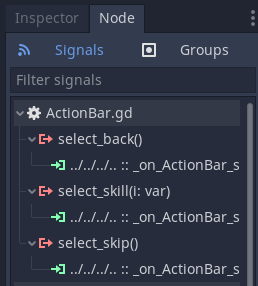
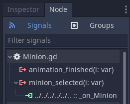

# Battle Scene Logic

The `BattleScene` puts together all the individual pieces to enable minion combat.
In the previous steps of this tutorial, we have implemented the logic for `ActionBar` and `Minion` components.
Now, we implement the main game logic, as seen in the [script file](https://github.com/git-afsantos/hs-mercs-clone/blob/main/scenes/battle/BattleScene.gd), that will set things in motion.

## General Idea

The main game logic follows a rather simple state machine.

1. The **Planning Phase**: collect player input for each of their minions.
2. The **Combat Phase**: sort player and enemy actions by *Speed* value, then resolve the actions.
3. End the round; go to the next Planning Phase until one of the players has no minions left.

Each of these states has a small number of steps to go through, but, right away, we can tell that we will need variables to keep track of the currently active minion, and variables to save all the player choices during the Planning phase, before the actions are resolved in the Combat phase.

In addition, we have to decide on how to solve Speed ties.
An easy solution is to decide randomly.
Here, though, we will opt for a more deterministic solution.
We will store a *tie breaker* variable that first will grant the advantage to the player, until a speed tie actually happens.
When it does, the tie breaker shifts to the opponent, so the opponent wins the next round with speed ties, etc..

With this in mind, it is time to move on the game logic itself.

## Initialization

This one is simple.
When the game starts, we jump straight to collecting player input.
In a more advanced version of the game, this is where you could play a few animations, to let the player know that combat is starting.

```gdscript
func _ready():
    randomize()
    _get_player_input()
```

Let us also take the opportunity to set up some necessary variables with references to the minions and to the action bar.

```gdscript
onready var _ui_action_bar: Control = $MainLayer/HBox/BattleArea/ActionBar
onready var _ui_minions: Array = [
    $MainLayer/HBox/BattleArea/Battlers/PlayerTeam/Minion,
    $MainLayer/HBox/BattleArea/Battlers/PlayerTeam/Minion2,
    $MainLayer/HBox/BattleArea/Battlers/PlayerTeam/Minion3,
    $MainLayer/HBox/BattleArea/Battlers/EnemyTeam/Minion,
    $MainLayer/HBox/BattleArea/Battlers/EnemyTeam/Minion2,
    $MainLayer/HBox/BattleArea/Battlers/EnemyTeam/Minion3
]
```


## Planning Phase

We know that in this phase we have to let both players select their actions, and then we have to store them.
Actions are not resolved immediately.
So, let us start by defining the necessary variables for this.

```gdscript
var _active_minion: int = -1
var _input_actions: Array = [-1, -1, -1, -1, -1, -1]
var _input_targets: Array = [-1, -1, -1, -1, -1, -1]
var _input_effects: Array = [-1, -1, -1, -1, -1, -1]
```

The `_active_minion` variable holds the index of the currently active minion (the one choosing its action for the turn).
There are six minions, so in the `_input_*` arrays we have to store six actions, six selected targets, and six skill effects.

We need also to decide which minions correspond to which indices.
Let us define player minions to indices `[0, 1, 2]` and enemy minions to indices `[3, 4, 5]`.

```gdscript
const PLAYER_FIRST_MINION: int = 0
const ENEMY_FIRST_MINION: int = 3
```


### Collecting Player Input

The `_get_player_input()` function referenced above is where the main logic for player input starts.
We want to set the active minion to the player's first minion, highlight that minion, and show the action bar.

```gdscript
func _get_player_input():
    _active_minion = PLAYER_FIRST_MINION
    _ui_minions[_active_minion].show_highlight()
    _ui_action_bar.show_action_bar()
    _update_action_bar()
```

We need also to update the action bar with the skills that the first minion knows.
Remember to disable the `Back` button if we are handling the first minion, as there is no other minion to go back to.

```gdscript
func _update_action_bar():
    var m = _ui_minions[_active_minion]
    _ui_action_bar.set_skill_1(
        m.skill_1_name,
        m.skill_1_speed,
        m.skill_1_cooldown,
        m.cd_skill_1 <= 0
    )
    _ui_action_bar.set_skill_2(
        m.skill_2_name,
        m.skill_2_speed,
        m.skill_2_cooldown,
        m.cd_skill_2 <= 0
    )
    _ui_action_bar.set_skill_3(
        m.skill_3_name,
        m.skill_3_speed,
        m.skill_3_cooldown,
        m.cd_skill_3 <= 0
    )
    if _active_minion == PLAYER_FIRST_MINION:
        _ui_action_bar.disable_back_button()
    else:
        _ui_action_bar.enable_back_button()
```

And this is the first stop for the main logic.
The game now sits idle, waiting for the user to interact with the action bar and fire some events.

Speaking of which, we now have to select the action bar in the node tree and connect some signals to handle its input.

### Action Bar Signals

Connect the custom signals we defined to new functions in the `BattleScene` script.



#### Skip a Turn

When the action bar emits a signal to skip a turn, we will store a special action value, for example `-1`, to distinguish it from other skills.
Then, we move on the the input of the next minion.

```gdscript
func _on_ActionBar_select_skip():
    _input_actions[_active_minion] = -1
    _ui_minions[_active_minion].skip_turn()
    _next_minion_input()
```

Moving on the next minion means advancing the active minion index, changing the highlights and updating the action bar.
If there are no more player minions left, we should *hide* the action bar instead, and call a function to handle the end of input collection.

```gdscript
func _next_minion_input():
    _ui_minions[_active_minion].hide_highlight()
    _active_minion += 1
    if _active_minion >= ENEMY_FIRST_MINION:
        _active_minion = -1
        _ui_action_bar.hide_action_bar()
        call_deferred("_player_input_done")
    else:
        _ui_minions[_active_minion].show_highlight()
        _update_action_bar()
```

#### Back to Previous Minion

When the action bar emits a signal to go back to the previous minion, we decrement the active minion index and shift the highlights accordingly.
We must also not forget to update the action bar.

```gdscript
func _on_ActionBar_select_back():
    assert(_active_minion > 0)
    _ui_minions[_active_minion].hide_highlight()
    _active_minion -= 1
    _ui_minions[_active_minion].hide_speed_tag()
    _ui_minions[_active_minion].show_highlight()
    _update_action_bar()
```

Updating the action bar simply means using the Action Bar Interface that we defined, to change the contents of its buttons.
Displayed data is gathered from the currently active minion.

```gdscript
func _update_action_bar():
    var m = _ui_minions[_active_minion]
    _ui_action_bar.set_skill_1(
        m.skill_1_name,
        m.skill_1_speed,
        m.skill_1_cooldown,
        m.cd_skill_1 <= 0
    )
    _ui_action_bar.set_skill_2(
        m.skill_2_name,
        m.skill_2_speed,
        m.skill_2_cooldown,
        m.cd_skill_2 <= 0
    )
    _ui_action_bar.set_skill_3(
        m.skill_3_name,
        m.skill_3_speed,
        m.skill_3_cooldown,
        m.cd_skill_3 <= 0
    )
    if _active_minion == PLAYER_FIRST_MINION:
        _ui_action_bar.disable_back_button()
    else:
        _ui_action_bar.enable_back_button()
```

#### Choose a Skill

Lastly, when the action bar emits a signal with a chosen skill, we store the skill as the selected action, and go to the minion's data to gather the corresponding skill effect and whether it is an hostile or friendly skill.
We highlight the appropriate minions in each case, to tell the player that we are accepting targets.
We must choose a target before advancing to the next minion.

```gdscript
var _expecting_target: bool = false
var _target_hostile: bool = true

func _on_ActionBar_select_skill(i: int):
    assert(_active_minion >= PLAYER_FIRST_MINION)
    assert(_active_minion < ENEMY_FIRST_MINION)
    _input_actions[_active_minion] = i
    var minion = _ui_minions[_active_minion]
    match i:
        0:
            _input_effects[_active_minion] = minion.skill_1_effect
            _target_hostile = minion.skill_1_hostile
        1:
            _input_effects[_active_minion] = minion.skill_2_effect
            _target_hostile = minion.skill_2_hostile
        2:
            _input_effects[_active_minion] = minion.skill_3_effect
            _target_hostile = minion.skill_3_hostile
        _:
            assert(false)
    if _target_hostile:
        _enable_enemy_targets()
    else:
        _enable_friendly_targets()
```

And here is how to highlight each type of target.

```gdscript
func _enable_enemy_targets():
    _expecting_target = true
    for i in range(ENEMY_FIRST_MINION, len(_ui_minions)):
        _ui_minions[i].show_highlight_enemy()

func _enable_friendly_targets():
    _expecting_target = true
    for i in range(ENEMY_FIRST_MINION):
        _ui_minions[i].show_highlight_friend()
```

This is again, a stopping point for the game's logic.
Once we transition to target selection, the game sits idle until a minion emits a signal telling the `BattleScene` that it has been selected.

### Minion Signals

This is a good time to go to the node tree and make a few changes to each of the six `Minion` nodes.
First, remember to change the *Minion Index* in the node Inspector to the correct index.
Then, go to the list of signals of each minion and connect **all** the `minion_selected` signals to a **single** `_on_Minion_selected` function.



Here is the callback function.

```gdscript
func _on_Minion_selected(i: int):
    if _expecting_target:
        assert(_active_minion >= PLAYER_FIRST_MINION)
        assert(_active_minion < ENEMY_FIRST_MINION)
        if _target_hostile:
            if i == _active_minion:
                return false # cannot target self
            if i < ENEMY_FIRST_MINION:
                return false # cannot target allies
            for i in range(ENEMY_FIRST_MINION, len(_ui_minions)):
                _ui_minions[i].hide_highlight()
        else:
            if i >= ENEMY_FIRST_MINION:
                return false # cannot target enemies
            for i in range(ENEMY_FIRST_MINION):
                _ui_minions[i].hide_highlight()
            # reactivate normal highlight for active minion
            _ui_minions[_active_minion].show_highlight()
        _expecting_target = false
        _input_targets[_active_minion] = i
        var a = _input_actions[_active_minion]
        _ui_minions[_active_minion].choose_skill(a)
        _next_minion_input()
```

As you can see, the callback function only does something *if* we are expecting a target to be selected.
In addition, it should do nothing if we are expecting hostile targets and select a friendly minion, or vice-versa.

Once we select a valid minion, we should restore the highlights to normal, tell the game that we are no longer expecting targets, and lock the skill selection for the active minion, before moving on to the next minion.

### Enemy Actions

Once we select the actions for all player minions, we still have to assign some action to the enemy minions.
An easy choice to start testing things is to let the enemies do nothing every time.
With a little more effort, however, we can put together a basic AI that chooses the first skill 20% of the time, the second skill 20% of the time, the third skill 20% of the time, and 40% of the time does nothing.

```gdscript
func _player_input_done():
    for i in range(ENEMY_FIRST_MINION, len(_ui_minions)):
        # AI
        var minion = _ui_minions[i]
        var action = randi() % 5
        _input_actions[i] = action
        match action:
            0:
                _input_effects[i] = minion.skill_1_effect
                assert(_input_effects[i] == 0)
                _input_targets[i] = randi() % 3
                _ui_minions[i].choose_skill(action)
            1:
                _input_effects[i] = minion.skill_2_effect
                assert(_input_effects[i] == 1)
                _input_targets[i] = randi() % 3
                _ui_minions[i].choose_skill(action)
            2:
                _input_effects[i] = minion.skill_3_effect
                assert(_input_effects[i] == 2)
                _input_targets[i] = (randi() % 3) + ENEMY_FIRST_MINION
                _ui_minions[i].choose_skill(action)
            _:
                _input_actions[i] = -1
                _ui_minions[i].skip_turn()
    call_deferred("_resolve_actions")
```

As you can see in the last line, once every minion has its action selected, it is time to move on to the next phase, the Combat phase.


## Combat Phase

TBD


The `_tie_break_player` variable tells whether the tie breaker is in favour of the player, while the `_speed_tied` variable tells whether there was a speed tie in the current round.
