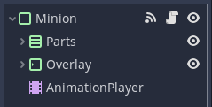
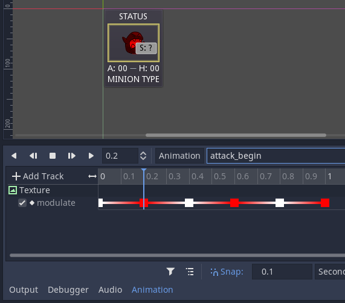
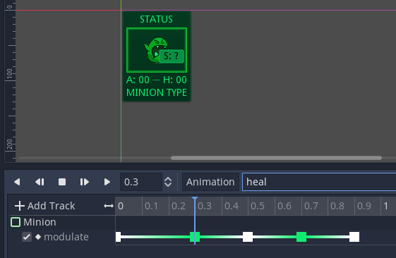

# Finishing Touches

In this step of the tutorial we are going to add some simple animations to minion combat.
The idea is to *pause* the game logic at specific points to let the animations play out.
This is similar to collecting player input.
We have to give up control of our logic somehow, wait until a specific event happens, and then resume the logic where it left off.

We are going to implement this with **signals**.
However, if we followed the same approach as for the main game logic, we would have to split our skill functions (and others) into parts.
We would have to keep pointers of where to go next, once an animation finishes, and that would be very confusing.
It is simpler to write down all the skill logic in a single unit, a single function.
But we still need a mechanism to stop execution at arbitrary points.
That is where the `yield` statement comes in.
It is recommended that you get familiar with how this statement works in Godot, before moving on.

## Minion Animations

Let us start by adding an `AnimationPlayer` node to the `Minion` scene.



Add a reference to it in the code.

```gdscript
onready var _animator: AnimationPlayer = $AnimationPlayer
```

And a signal to tell that a minion's animation has finished.

```gdscript
signal animation_finished(i)
```

Contrary to other signal handlers that we have defined before, we will not set up a callback function for the `AnimationPlayer`'s `animation_finished` event.
We will listen for this event at specific points, using `yield`.

### The Animation Player

Let us add now a few example animations to a minion.
We will add the following animations:

- `attack_begin`: start an attack;
- `attack_end`: finish an attack;
- `cast_begin`: start casting a spell;
- `cast_end`: finish casting a spell;
- `damage`: take damage;
- `heal`: heal damage.

Do whatever you like with these animations.
Feel free to explore different properties, add movement, special effects and colours.

The example animations used in this repository are all very similar.
They all use the `modulate` or `self_modulate` properties of specific nodes under the `Minion` tree to change the colours of things temporarily.
For instance, starting an attack has the minion blink red three times, as if entering some kind of rage.



Healing damage, however, has the minion card turn green a few times.



Once you are satisfied with the animations, it is time to go back to the minion interface functions in the script.
We are going to change the interface, add a few more functions, so that the `BattleScene` can ask a minion to play its animations at certain points.

### Minion Interface

All the new functions have the same structure.
We ask the `AnimationPlayer` to play an animation, we `yield` control until the animation is finished, the previously instant effect takes place (if applicable), and the minion emits a signal telling that its animation has finished.

An animation to heal damage:

```gdscript
func animate_heal_damage(dmg: int):
    _animator.play("heal")
    yield(_animator, "animation_finished")
    heal_damage(dmg)
    emit_signal("animation_finished", minion_index)
```

An animation to take damage:

```gdscript
func animate_take_damage(dmg: int):
    _animator.play("damage")
    yield(_animator, "animation_finished")
    take_damage(dmg)
    emit_signal("animation_finished", minion_index)
```

And animations to attack or cast spells:

```gdscript
func animate_attacking():
    _animator.play("attack_begin")
    yield(_animator, "animation_finished")
    emit_signal("animation_finished", minion_index)

func animate_attack_done():
    _animator.play("attack_end")
    yield(_animator, "animation_finished")
    emit_signal("animation_finished", minion_index)

func animate_casting():
    _animator.play("cast_begin")
    yield(_animator, "animation_finished")
    emit_signal("animation_finished", minion_index)

func animate_cast_done():
    _animator.play("cast_end")
    yield(_animator, "animation_finished")
    emit_signal("animation_finished", minion_index)
```


## Battle Scene Animations

We now move into the final stages of this tutorial.
We are going to define the high-level animations for each action.

First, understand that there are two levels of animation: an animation played by a child node, and the global animation for a certain feature or mechanic (that may involve animations from several children).
We will start by adding a signal to the `BattleScene` that it will use to signal itself when a top-level animation has finished.
This will allow the main logic to make progress, after a `yield`.

```gdscript
signal animation_finished()
```

You can optionally defined a constant for the signal name, so that you are not writing the same string all the time.

```gdscript
const ANIMATION_FINISHED: String = "animation_finished"
```

### Waiting for Top-Level Animations

The `_resolve_actions()` method is the first we have to change.
Assuming that the `_basic_attack`, the `_safe_attack` and the `_basic_heal` method will define and play out their own animations, we want to wait for the top-level animation to finish at the end of the function, before moving to the next round.
Notice the new `yield` statement.

```gdscript
func _resolve_actions():
    var minions = _ui_minions.duplicate()
    minions.sort_custom(self, "_minion_speed_sort")
    for i in range(len(minions)):
        if minions[i].minion_health <= 0:
            continue
        var j = minions[i].minion_index
        var action = _input_actions[j]
        var target = _ui_minions[_input_targets[j]]
        var effect = _input_effects[j]
        if action < 0:
            continue
        match effect:
            0:
                _basic_attack(minions[i], target)
            1:
                _safe_attack(minions[i], target, 2)
            2:
                _basic_heal(minions[i], target, 6)
            _:
                assert(false, "effect not yet implemented")
        yield(self, ANIMATION_FINISHED)
    call_deferred("_next_round")
```

> **Note:** `yield` must be used with caution, as it simply returns to the calling function an object that represents the interrupted function.
> For top-level animations, it is good practice to only use `yield` in the *root* function (the top level function that you control) of a specific frame.
> This also works because we are *not* defining a callback for the `_process(delta)` or `_physics_process(delta)` events.
> If we were, things would have to be done differently.

### Defining Skill Animations

This is the last step.
Go through the functions implementing each skill effect, and decide which animations you want to play and when.
Simultaneous animations can be called one right after another.
Sequential animations should use `yield` in between to wait for one of them (the longest or the shortest, your choice).

For example, for the basic attack, we want to follow these steps:

1. the attacker plays the animation to start an attack;
2. wait until the animation finishes;
3. the defender plays the animation for taking damage (and takes the damage);
4. wait until the animation finishes;
5. the attacker receives damage back (instant, no animation);
6. the attacker plays the animation to finish attacking;
7. wait until the animation finishes;
8. signal that the top-level animation is finished.

Which, turned into code, looks like the following.

```gdscript
func _basic_attack(attacker, defender):
    attacker.animate_attacking()
    yield(attacker, ANIMATION_FINISHED)
    defender.animate_take_damage(attacker.minion_power)
    yield(defender, ANIMATION_FINISHED)
    attacker.take_damage(defender.minion_power)
    attacker.animate_attack_done()
    yield(attacker, ANIMATION_FINISHED)
    emit_signal("animation_finished")
```

The animations for `_safe_attack` and `_basic_heal` follow the same thought process, there is not much to explain.

```gdscript
func _safe_attack(attacker, defender, dmg):
    attacker.animate_attacking()
    yield(attacker, ANIMATION_FINISHED)
    defender.animate_take_damage(dmg)
    yield(defender, ANIMATION_FINISHED)
    attacker.animate_attack_done()
    yield(attacker, ANIMATION_FINISHED)
    emit_signal("animation_finished")

func _basic_heal(caster, target, dmg):
    caster.animate_casting()
    yield(caster, ANIMATION_FINISHED)
    target.animate_heal_damage(dmg)
    yield(target, ANIMATION_FINISHED)
    caster.animate_cast_done()
    yield(caster, ANIMATION_FINISHED)
    emit_signal("animation_finished")
```

And that concludes this tutorial.
If everything went well, you should now have a playable game that is similar to the demo in this repository.
This is also a good starting point to make some improvements and add your own minions, skills and animations!

**Have fun!**
